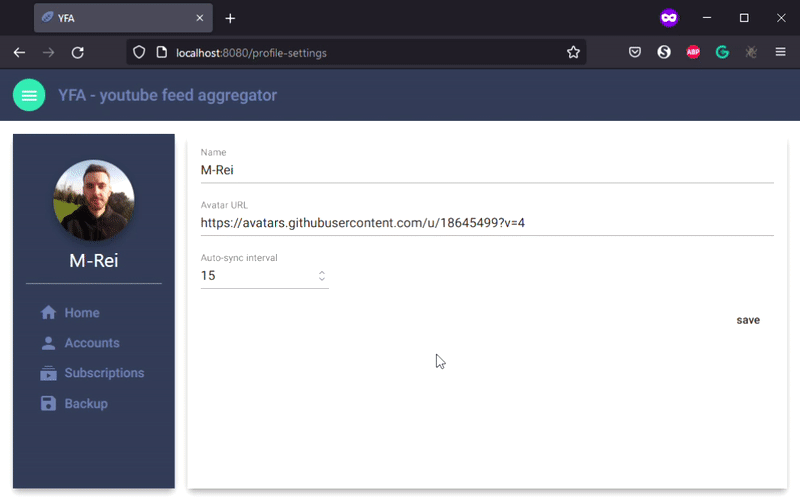

# YFA - youtube feed aggregator

If you have multiple youtube accounts and wish to aggregate all their feeds visually into one place, this is a good solution for you

## Setup

### Local

You only need docker, if you wish to run this locally. I recommend installing docker-desktop (windows).

Simply execute the [docker_compose_start.cmd](docker_compose_start.cmd) file!

The app can be accessed by visiting: [localhost:8080](http://localhost:8080)

### Hosting

You need to install npm (14.19.3), use something like nvm for managing multiple npm installations. Once installed, run this command in the
root directory:

    npm run build

The dist folder will contain the files you can then host!

## How to - with gifs

### 1. Setting up your profile

### 2. Setting up accounts

### 3. Setting up subscriptions

#### 3.1 Manually

#### 3.2 Via import

### 4. Loading feeds

